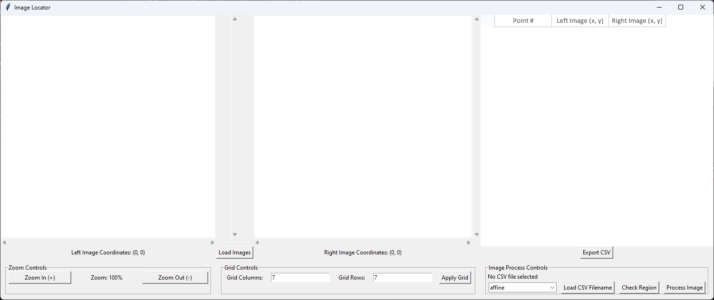
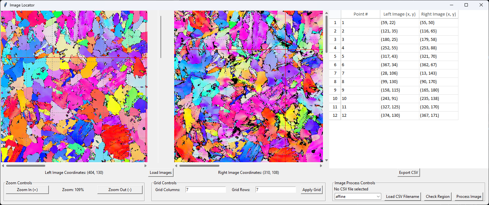
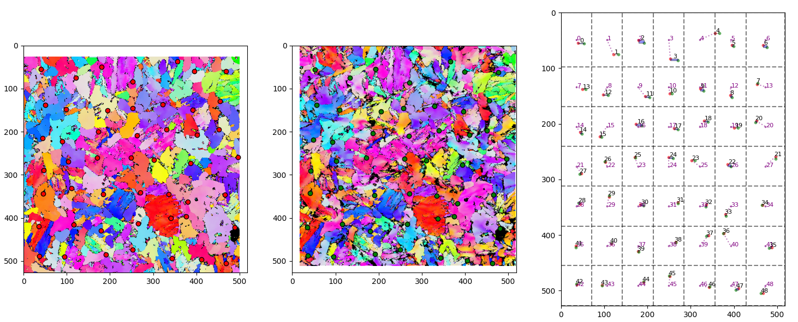
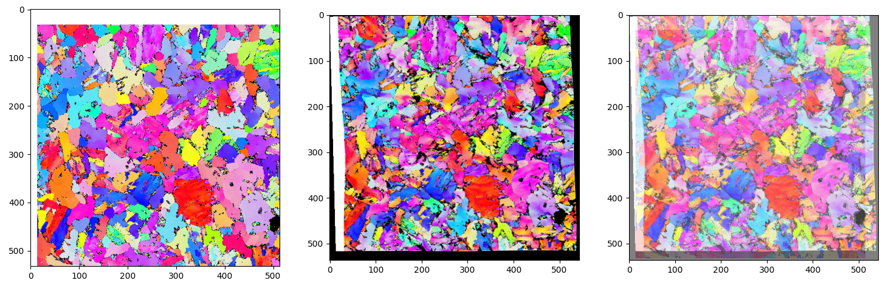

# Grid Based Image Warping

The programe is for warped the image with GUI.
And it base on ***Affine*** or ***Project*** Transform and ***Bicubic Interpolation***.

## Initial GUI

Install the package, in terminal:

```
git clone https://github.com/jaja7749/grid-based-image-warping.git

cd grid-based-image-warping

pip install -r requirements.txt

python main.py
```



## Start label the points

- Load two image to find the same position and label it.
- Make sure each grid have one point.
- The coordinate would auto show on table

### Operating Instructions:

| Action                    | Function    |
|---------------------------|-------------|
|***left click***           |mark point   |
|***right click***          |cancel point |
|***ctrl + right click***   |move image   |



## Image processing

- After you mark points, you should save the *csv* file first.
- The programe can load the *csv* file to process the image, but the grid sould be same.
- After you load the *csv* file. To push the ***Check Region*** button for checking each region have one point, multi points may not work.
- Finally, push ***Process Image***, and you would get the two new images.





## Without GUI

Just import the **image_process** to your programe.

```python
import pandas as pd
import numpy as np
import cv2
import matplotlib.pyplot as plt
from image_process import process

before = cv2.imread("Before.png")
after = cv2.imread("After.png")
before = cv2.cvtColor(before, cv2.COLOR_BGR2RGB)
after = cv2.cvtColor(after, cv2.COLOR_BGR2RGB)
method = process(before, after, "transfer_file.csv", grid=(7, 7), fix_type="affine")
before, after = method()

fig = plt.figure(figsize=(30, 10))
plt.subplot(1, 3, 1)
plt.imshow(before)
plt.subplot(1, 3, 2)
plt.imshow(after)
plt.subplot(1, 3, 3)
plt.imshow(before, alpha=0.5)
plt.imshow(after, alpha=0.5)
plt.show()
```
